<div align="center">

# Structured Data Extraction Pipeline

**Schema-first document extraction with Claude — strict tool use, validation-retry loops,<br/>
Message Batches at scale, and confidence-based human review.**

[](https://github.com/Jagoul/structured-data-extraction-pipeline/actions/workflows/ci.yml)


</div>

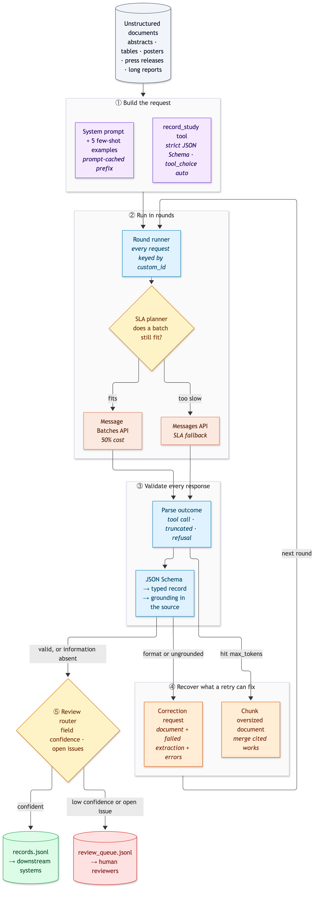

<details>
<summary>Diagram source (Mermaid)</summary>

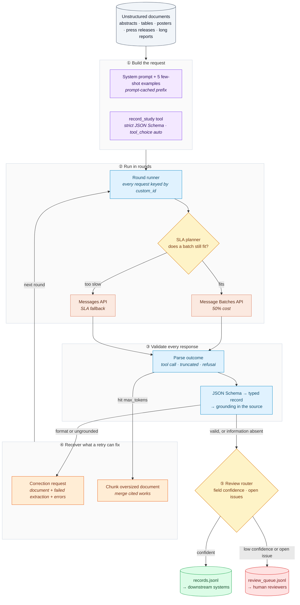

</details>

Documents go in; validated, source-grounded JSON records come out, and anything the pipeline can't
stand behind goes to a person with the exact fields to check. Every value Claude extracts must quote
the sentence it came from, every failure is classified by whether a retry can fix it, and a
100-document batch finishes inside its SLA even when some documents need a second round.

## Results at a glance

Measured on the 100-document corpus (`docs/results/`). Full tables follow in each section.

| | **Claude Opus 5.5** (Batches API) | **Claude Haiku 4.5** (stress test) |
|---|---|---|
| Field accuracy vs ground truth | **100%** (all 9 fields, all 7 document types) | 99% first pass; every error then caught or routed |
| Fabricated values for absent fields | **0 of 135** | 3 (all caught by the grounding rule below) |
| Documents needing a retry | 0 | 3 fixed by retry, 2 by chunking, 2 routed to a human |
| Auto-accepted / sent to a human | 79 / 21 | 95 / 5 |
| Processing time (SLA 4 h) | **3.11 h**, SLA met | 11 min (synchronous) |
| Cost | $2.86 (batch discount applied) | $0.63 |

Opus 5.5 was near-perfect on this corpus, so the Haiku run is what shows the safety net working:
it exposed two real gaps in the first version of the pipeline, described in
[section 3](#3-validation-and-the-retry-loop) and [section 5](#5-batch-processing-at-scale), and
both are now fixed.

---

## Contents

- [Why this design](#why-this-design)
- [1. Architecture](#1-architecture)
- [2. The extraction contract](#2-the-extraction-contract)
- [3. Validation and the retry loop](#3-validation-and-the-retry-loop)
- [4. Few-shot examples for structural variety](#4-few-shot-examples-for-structural-variety)
- [5. Batch processing at scale](#5-batch-processing-at-scale)
- [6. Human review routing and accuracy](#6-human-review-routing-and-accuracy)
- [Quick start](#quick-start)
- [Usage](#usage)
- [Outputs and downstream integration](#outputs-and-downstream-integration)
- [Configuration](#configuration)
- [Testing](#testing)
- [Design decisions and trade-offs](#design-decisions-and-trade-offs)
- [Project structure](#project-structure)
- [Contributing, security, license](#contributing-security-license)

---

## Why this design

| Problem in LLM extraction | How this pipeline handles it |
|---|---|
| **Malformed JSON** | Structured output through a `strict: true` tool. The API guarantees the shape: types, enums, required keys. |
| **Rules strict mode can't express** (patterns, ranges, conditional fields) | A second, stricter JSON Schema plus a typed Pydantic record, enforced after every response. |
| **Plausible but invented values** | Every non-null field must carry a verbatim evidence quote, and the quote must appear in the document. |
| **Wasted retries** | Each validation issue is classified. Format problems are retried with the exact error; information that is absent from the source is never retried. |
| **Varied document structure** | Five few-shot examples teach inline vs numbered citations, prose vs tables, URL DOIs, and designs outside the enum. |
| **Cost and throughput at 100+ documents** | Message Batches at 50% cost, results routed by `custom_id`, failed requests resubmitted with a fix, oversized documents chunked. |
| **Deadlines** | An SLA planner that switches to the synchronous API when another batch round would not finish in time. |
| **Knowing when not to trust the output** | Field-level confidence, a stricter bar for critical fields, and a review queue that names the fields to check. |

---

## 1. Architecture

| Component | Responsibility | Module |
|---|---|---|
| **Schema** | The extraction contract: one field catalogue, a strict-mode schema for the API, a full schema for local validation and downstream consumers, and the typed `StudyRecord`. | `schema.py` |
| **Prompts** | System prompt, five few-shot examples, and the extraction, correction, and chunk messages. | `prompts.py` |
| **LLM layer** | Builds one request shape for both APIs, parses every stop reason into a `CallOutcome`, and wraps the sync and Batches clients behind protocols. | `llm.py` |
| **Job** | One document's state machine: extract, validate, correct, chunk, resubmit, finish. Shared by the batch and sync paths. | `jobs.py` |
| **Validation** | JSON Schema, typed record, and grounding checks, each issue classified by retryability. | `validation.py` |
| **Runner + SLA** | Collects pending requests into rounds, keys them by `custom_id`, and picks batch or sync per round. | `runner.py`, `sla.py` |
| **Review router** | Decides auto-accept vs human review from confidence and open issues. | `review.py` |
| **Evaluation + report** | Accuracy by document type and field, null handling, calibration, retry statistics. | `evaluation.py`, `report.py` |
| **Corpus** | Deterministic 100-document synthetic corpus with exact ground truth. | `corpus.py` |
| **CLI** | `extractor corpus \| extract \| run \| ab-test \| schema \| validate` | `cli.py` |

One idea holds it together: a job says **what** to send next, and the runner decides **how**, as a
batch or synchronous calls. The retry logic therefore exists once, and the offline tests run
exactly the code that runs in production.

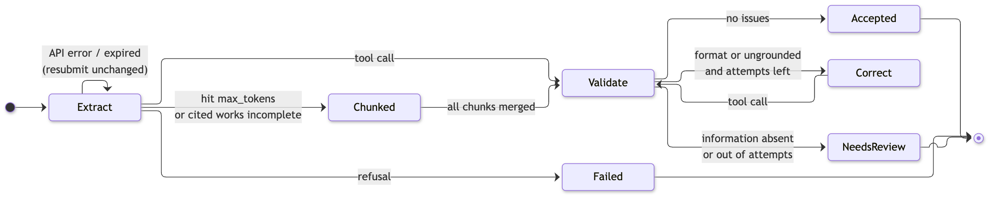

<details>
<summary>Diagram source (Mermaid)</summary>

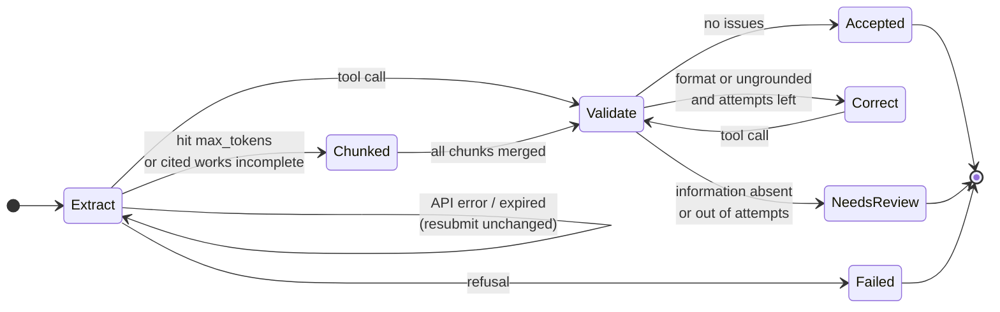

</details>

---

## 2. The extraction contract

The target domain is research-study metadata for a systematic-review database: exactly the kind of
source where fields are often missing, formats vary, and a fabricated sample size is worse than none.

| Field | Kind | Notes |
|---|---|---|
| `title`, `authors`, `study_type`, `key_findings`, `cited_works` | **required** | `authors` as written; `cited_works` from inline citations *and* numbered reference lists |
| `publication_year`, `doi`, `sample_size`, `funding_source`, `primary_outcome` | **required key, nullable value** | `null` when the document doesn't say. Never inferred. |
| `study_type` + `study_type_detail` | **enum + "other" + detail** | 7 designs plus `other`; `other` requires the document's own name for the design |
| `keywords`, `trial_registration` | **optional** | may be omitted entirely |
| `field_confidence` | **required** | 0–1 per scored field, including confidence that a null is correct |
| `evidence` | **required** | verbatim quote per grounded field; `null` for null fields |

**Two schemas, one source of truth.** `strict: true` guarantees structure, but it does not accept
`pattern`, `minimum`/`maximum`, `minLength`, array bounds, or conditionals. The pipeline therefore
builds both schemas from one catalogue:

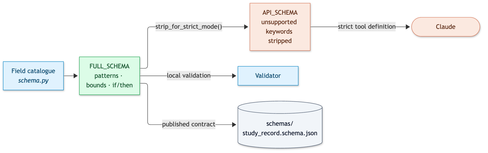

<details>
<summary>Diagram source (Mermaid)</summary>

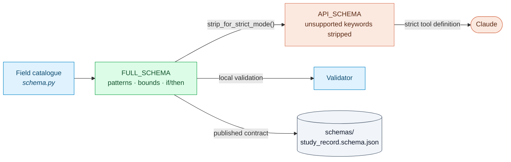

</details>

> **Forcing the tool call.** Current models reject `tool_choice: {"type": "tool"}` with a 400.
> The pipeline uses `tool_choice: auto`, names the tool in the system prompt and the user message,
> and treats a response without a tool call as its own outcome, with its own retry.

**Null, not fabricated.** The corpus deliberately leaves out DOIs, funding, sample sizes, years, and
outcomes, and plants distractors: a cited work's year is not the publication year, and "18 studies"
is not a sample size.

**Measured** (Opus 5.5, 100 documents). Of 135 field values the documents genuinely don't contain,
all 135 came back `null`, and none was fabricated:

| Field | Truly absent | Returned null | Fabricated | Present | Missed |
|---|---|---|---|---|---|
| `publication_year` | 7 | 7 | 0 | 93 | 0 |
| `doi` | 44 | 44 | 0 | 56 | 0 |
| `sample_size` | 18 | 18 | 0 | 82 | 0 |
| `funding_source` | 45 | 45 | 0 | 55 | 0 |
| `primary_outcome` | 21 | 21 | 0 | 79 | 0 |

The weaker model shows why the evidence rule exists. Haiku 4.5 returned a publication year for 3
documents that state none, reading it out of the DOI (`10.5555/coq.2014.6797`). The quote was real
and contained "2014", so a plain "quote must appear in the document" check passed it. The
grounding layer now requires a year to appear as a date in its quote, not inside a DOI or URL.

---

## 3. Validation and the retry loop

Every response passes three layers, and every problem is labelled by whether a retry can fix it.

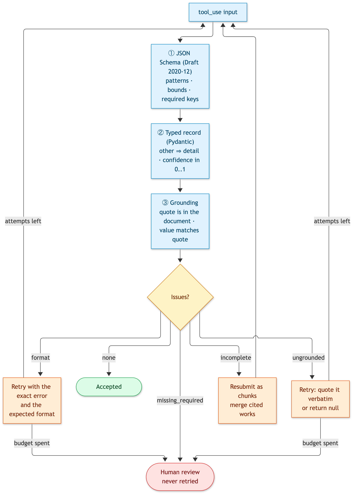

<details>
<summary>Diagram source (Mermaid)</summary>

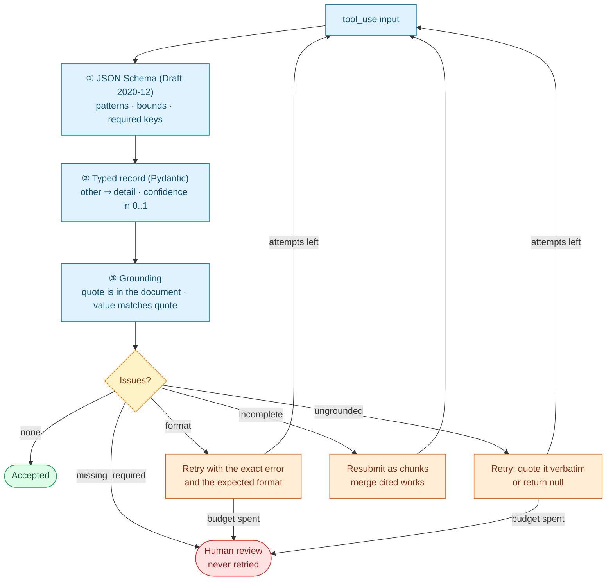

</details>

| Issue kind | Example | Retryable? | Why |
|---|---|---|---|
| `format` | `"https://doi.org/10.5555/…"`, `"1,204"` as a string, year `21` | **Yes** | The information is in the document; only its shape is wrong. |
| `ungrounded` | a DOI whose quote isn't in the text; `sample_size: 1500` quoting "1,204" | **Yes, once** | Either quote the real sentence or admit it isn't there (null). |
| `missing_required` | no author named anywhere, returned as `"unknown"` | **No** | No prompt can recover information the source doesn't contain. |
| `incomplete` | 242 cited works extracted, but the document numbers 400 references | **No: chunk it** | Asking again returns the same short list. Splitting the document fixes it. |

The follow-up request contains exactly what the model needs to fix it: **the document, the failed
extraction, and the specific errors**, each with the expected format:

```text
<validation_errors>
- doi [format]: 'https://doi.org/x' does not match '^10\.\d{4,9}/\S+$'. Expected: Bare DOI
  starting with '10.' (strip any https://doi.org/ prefix). null if the document has no DOI.
- sample_size [ungrounded]: value 1500 is not supported by its evidence quote '| Participants | 1,204 |'
</validation_errors>
```

**Measured.** On Opus 5.5 the loop never had to fire: all 100 documents were valid on the first
attempt, and the only issue seen was `missing_required` on the 3 anonymous notes (correctly not
retried). Haiku 4.5 triggered it for real. After the year-in-DOI rule was added, the 3 affected
documents were re-run live:

| Document | First attempt | Retry (document + failed extraction + error) |
|---|---|---|
| `doc-014` poster | `publication_year: 2014`, quote is a DOI: `ungrounded` | `null`, accepted |
| `doc-077` poster | `publication_year: 2020`, quote is a DOI: `ungrounded` | `null`, accepted |
| `doc-072` long report | `publication_year: 2023`, quote is a DOI: `ungrounded` | `null`, accepted (after chunking) |

Across the re-run, 5 of the 9 issues raised (`ungrounded` and `incomplete`) were resolved by a
retry or by chunking; the rest were routed to a human. The `missing_required` issues were never retried, so no request was spent
on information the documents do not contain.

---

## 4. Few-shot examples for structural variety

The system prompt carries five worked examples, each a short document and its correct tool input.
They are validated by the pipeline's own validator in the test suite, so an example can never teach
something the validator would reject.

| Example | Teaches |
|---|---|
| `narrative_inline_citations` | prose abstract, `(Garcia et al., 2015)` citations, funding absent → `null` |
| `table_numbered_bibliography` | table rows, `Not reported` → `null`, URL DOI → bare DOI, `1,204` → `1204`, numbered references |
| `poster_other_design` | terse poster, `Delphi consensus study` → `other` + detail, `n.d.` → `year: null` |
| `press_release_review` | journalistic prose; "18 studies" is **not** a sample size; no DOI |
| `anonymous_note` | no author anywhere → `"unknown"` with confidence 0.0, so a human sees it |

The examples sit in the cached system prompt, so across a batch they are paid for once at full
price and then read from cache.

**Measured** (Haiku 4.5, 40 documents, [full table](docs/results/few-shot-vs-zero-shot.md)).
Opus 5.5 is at 100% with examples, so it can't show an effect. Haiku can, and the clearest signal is
in null handling: **without the examples it invented a value for an absent field 4 times** (3
`primary_outcome`, 1 `sample_size`); **with them, once**. Final accuracy is 99.2% with examples and
98.9% without, which is within noise on 40 documents. It is also not a controlled comparison,
because the few-shot run predates two validator fixes, so treat it as a signal, not proof.

---

## 5. Batch processing at scale

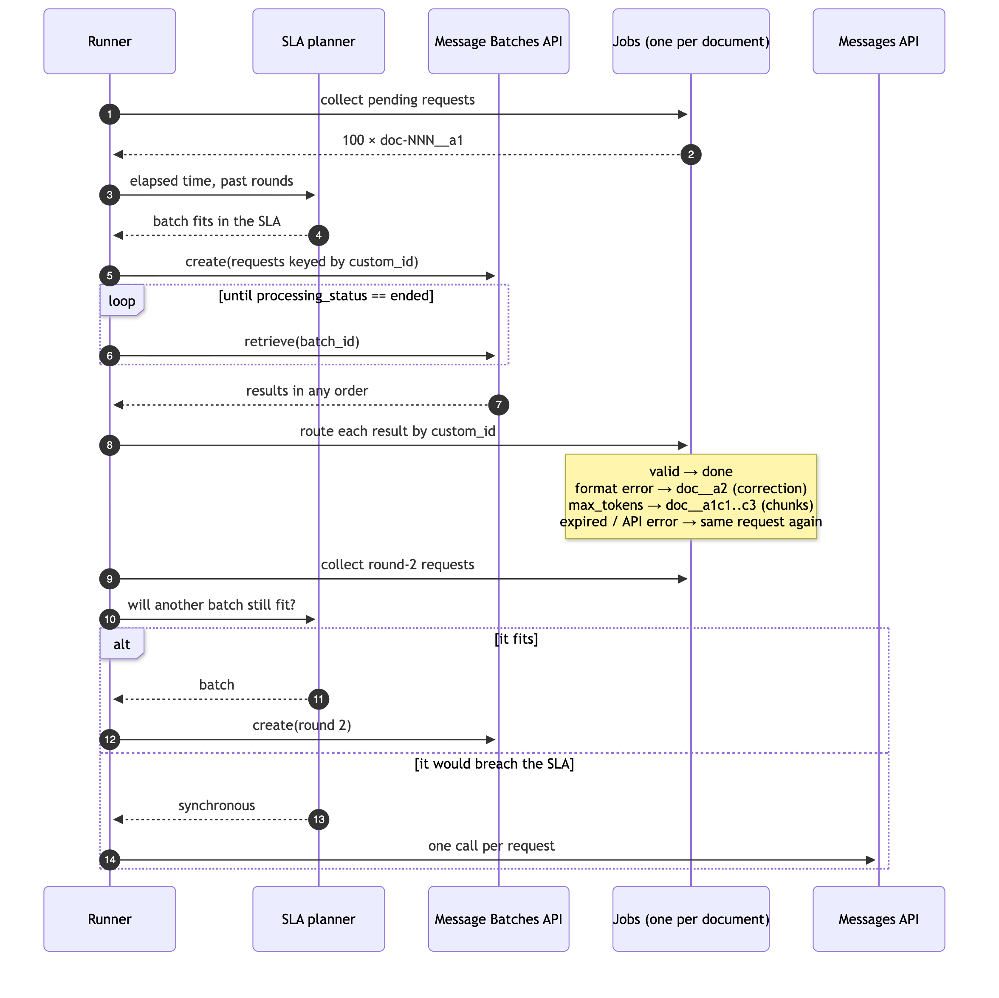

<details>
<summary>Diagram source (Mermaid)</summary>

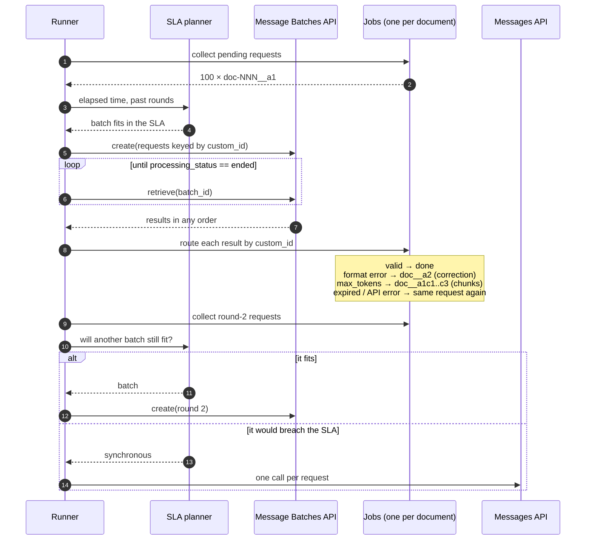

</details>

**`custom_id` scheme.** `<doc_id>__<request key>`, e.g. `doc-042__a1` (first attempt), `doc-042__a2`
(correction), `doc-008__a1c3` (third chunk of an oversized document). Results are always routed
by `custom_id`, never by position. The test fakes return results in reverse order to prove it.

| Batch result | What the job does next |
|---|---|
| `succeeded` + valid tool call | done |
| `succeeded` + validation issues | correction request in the next round |
| `succeeded` + a cited-works list far shorter than the document's numbered references | **split into chunks**, the same path as truncation |
| `succeeded` + `stop_reason: max_tokens` | **split into chunks**, resubmit: part 1 with `record_study`, the rest with `record_cited_works`, merged in order |
| `succeeded` + no tool call | correction request asking for the tool |
| `errored` (server / overloaded), `expired`, `canceled`, or missing | resubmit the same request (bounded) |
| `errored` (`invalid_request`, context overflow) | chunk; other invalid requests fail |
| `succeeded` + `stop_reason: refusal` | fail and route to human review |

**SLA.** The planner estimates the next batch from the slowest one observed, with a 1.5× margin
(one hour before any has run), and compares that with the time left. If it doesn't fit, the round
runs synchronously at full price. The report states total processing time, the share of the SLA
used, and the worst case if every round took the Batches API's 24-hour maximum.

**Measured** (Opus 5.5, 100 documents, SLA 4 h, [full report](docs/results/opus-5-5-batch/report.md)):

| Round | Mode | Requests | Duration | Why |
|---|---|---|---|---|
| 1 | batch | 100 | 2.26 h | estimated 1.0 h fits in the remaining 4.0 h |
| 2 | sync | 15 | 45.3 min | estimated batch time 3.4 h exceeds the remaining 1.6 h |

The batch returned **100 of 100 succeeded** (0 errored, 0 expired). Three long reports hit
`max_tokens`, and their 15 chunk requests went into round 2. The planner observed that round 1 took
2.26 h, estimated the next batch at 3.4 h (1.5x margin), saw only 1.6 h left, and ran the
round synchronously. **Total 3.11 h, 77.7% of the SLA.** Had it queued another batch, the run would
have missed its deadline. Worst case if every round took the 24 h maximum: 24 h per batch round.

Prompt caching: 77% of the cacheable prefix was served from cache.

**Two things the Haiku run taught.** (1) A model can stop listing references early and still
finish normally, with no `max_tokens` signal, so Haiku returned 242 to 390 of 400 references on
four long reports and chunking never triggered. The validator now counts the numbered entries in the
source and, when `cited_works` falls under 95% of them, resubmits the document as chunks. (2) Even
chunked, Haiku dropped references on two reports (357 and 348 of 400): those are now detected and
routed to a human instead of being auto-accepted. Opus 5.5 was unaffected (400 of 400 every time).

---

## 6. Human review routing and accuracy

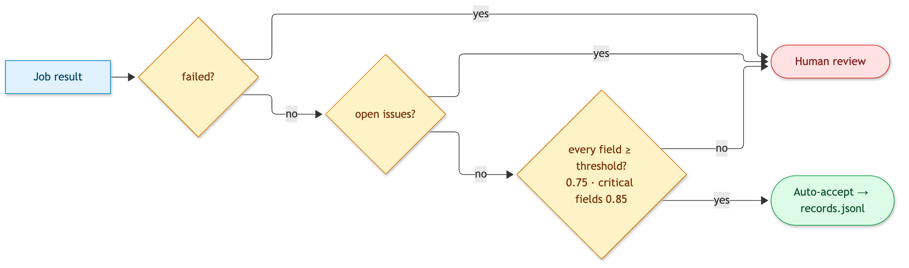

<details>
<summary>Diagram source (Mermaid)</summary>

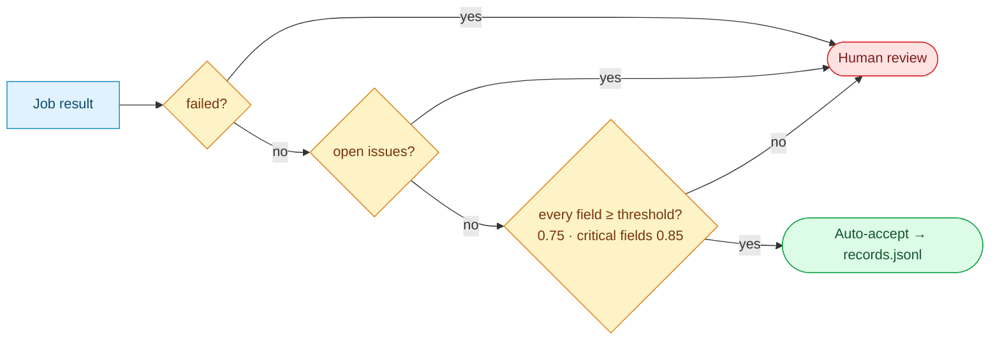

</details>

Critical fields (`sample_size`, `doi`, `study_type`), the ones a meta-analysis depends on, need
0.85 confidence instead of 0.75. Each review item lists the reasons and the exact fields to check:

```json
{"doc_id": "doc-003", "route": "human_review",
 "reasons": ["unresolved missing_required issue on authors: the document names no authors",
             "low confidence on authors: 0.00 < 0.75"],
 "fields_to_check": ["authors"]}
```

**Measured** (Opus 5.5, 100 documents). Accuracy by document type and field is 100% everywhere,
and no document type falls below a field's overall accuracy, so performance is consistent across
formats:

| Field | biblio. | poster | long report | narrative | press | table | tech. note | All |
|---|---|---|---|---|---|---|---|---|
| `title` `authors` `doi` `study_type` `sample_size` `funding_source` `primary_outcome` `cited_works` | 100% | 100% | 100% | 100% | 100% | 100% | 100% | **100%** |
| `publication_year` | 100% | 100% | 100% | 100% | 100% | 100% | 100% | **100%** |

**Routing.** 79 documents were auto-accepted and 21 went to a human: 3 with a real issue (no
author named) and 18 because a confidence score sat below its threshold. All 18 were in fact
correct, so on this model the thresholds are conservative. With zero errors, this run cannot
say whether the confidence scores are well calibrated.

**Haiku 4.5 makes the analysis discriminating** (99% first pass, 7 documents with an error):

| Field / type | Haiku 4.5 | Note |
|---|---|---|
| `publication_year` on `long_report` | 80% (vs 97% overall) | flagged as an inconsistent cell |
| `cited_works` on `long_report` | 0% (vs 95% overall) | flagged as an inconsistent cell |
| errors auto-accepted with no flag, before the fixes | 6 of 7 | routing on confidence alone missed them |
| the same, after the two validator fixes | 1 of 7 | the last is 390 of 400 references, inside the 95% tolerance |

The per-type breakdown found the weak spot in one table. The validator fixes turned it from a
silent error into a retry, a chunked resubmission, or a human review. Confidence alone is not
enough: the fabricated years carried confidence 0.80 to 0.95.

---

## Quick start

Requirements: Python 3.12+, [uv](https://docs.astral.sh/uv/), and an
[Anthropic API key](https://console.anthropic.com/) for live runs.

```bash
git clone https://github.com/Jagoul/structured-data-extraction-pipeline.git
cd structured-data-extraction-pipeline
uv sync                                   # install
cp .env.example .env                      # then set ANTHROPIC_API_KEY in .env
make check                                # lint, strict types, 130 offline tests (no key needed)

uv run extractor extract data/documents/doc-005.md   # one document, with the trace
uv run extractor run                                  # all 100 documents via the Batches API
```

The hands-on walkthrough of every feature, with sample output, is in **[docs/GUIDE.md](docs/GUIDE.md)**.

---

## Usage

| Command | What it does |
|---|---|
| `extractor extract <file>` | Extract one document synchronously and print the request trace, the record, and the routing decision |
| `extractor run [--limit N] [--sla-hours H] [--sync] [--no-few-shot]` | Run the corpus through the Batches API; write `runs/<run_id>/` |
| `extractor ab-test [--limit N]` | Few-shot vs zero-shot on the same documents, in the same batch |
| `extractor corpus [--seed S]` | Regenerate the synthetic corpus and ground truth |
| `extractor schema [--out FILE]` | Print or write the published JSON Schema |
| `extractor validate <extraction.json> <document>` | Validate any extraction offline, exactly as the pipeline does |

A single-document run looks like this:

```text
$ uv run extractor extract data/documents/doc-008.md        # an oversized report
round 1: 1 request(s) via sync (synchronous mode requested)
round 2: 3 request(s) via sync (synchronous mode requested)
  · a1: truncated (hit max_tokens)
  · response truncated at max_tokens: resubmitting as 3 chunks
  · a1c1: tool_call
  · a1c2: tool_call
  · a1c3: tool_call
  · accepted: valid extraction
accepted → auto_accept
```

---

## Outputs and downstream integration

Each run writes a self-contained folder:

```text
runs/<run_id>/
├── run.json            settings, timings, SLA report, token usage, cost
├── results.jsonl       every document: status, extraction, attempts with issues, event trace
├── records.jsonl       auto-accepted records only — validated against the published schema
├── review_queue.jsonl  documents for a human, with reasons and fields to check
├── evaluation.json     accuracy against ground truth, retry statistics
└── report.md           the human-readable summary
```

Downstream systems ingest **`records.jsonl`** and validate it against
**[`schemas/study_record.schema.json`](schemas/study_record.schema.json)** (JSON Schema 2020-12),
or import the typed model directly:

```python
from extraction_pipeline.schema import StudyRecord

record = StudyRecord.model_validate(row["record"])  # raises on any contract violation
```

A record reaches `records.jsonl` only if it passed every validation layer **and** the router
auto-accepted it. Nothing partial or unconfident flows downstream.

---

## Configuration

All settings have safe defaults and can be overridden with environment variables (or `.env`):

| Variable | Default | Purpose |
|---|---|---|
| `ANTHROPIC_API_KEY` | – | API key (required for live runs) |
| `EXTRACTOR_MODEL` | `claude-opus-5-5` | Model for every request |
| `EXTRACTOR_EFFORT` | `medium` | `low` · `medium` · `high` · `xhigh` · `max` |
| `EXTRACTOR_MAX_TOKENS` | `8192` | Output cap; a response that hits it is chunked |
| `EXTRACTOR_MAX_ATTEMPTS` | `3` | Validation attempts per document |
| `EXTRACTOR_CHUNK_TOKENS` | `6000` | Chunk size for oversized documents |
| `EXTRACTOR_REVIEW_THRESHOLD` | `0.75` | Confidence below this routes a field to review |
| `EXTRACTOR_CRITICAL_THRESHOLD` | `0.85` | Stricter bar for `sample_size`, `doi`, `study_type` |
| `EXTRACTOR_SLA_HOURS` | `4` | Processing-time SLA for a run |
| `EXTRACTOR_POLL_SECONDS` | `20` | Batch polling interval |

Synchronous calls opt into server-side refusal fallbacks (`fallbacks: "default"`). The Batches API
does not accept that parameter, so a refusal inside a batch is routed to human review instead.

---

## Testing

| Layer | Command | What it proves |
|---|---|---|
| **Offline** (CI) | `make test` | 130 tests, 90% coverage, no API key. The state machine, runner, SLA planner, validation, evaluation, and CLI are driven by faithful fakes of the Messages and Batches APIs. |
| **Types** (CI) | `make types` | `mypy --strict` across the package |
| **Live** | `make live` | Against the real API: absent fields come back null, a URL DOI is normalised, and an anonymous note is routed to a human without a retry |
| **Experiments** | `extractor run`, `extractor ab-test` | The measured numbers in this README |

Highlights of the offline suite:

- Every few-shot example passes the pipeline's own validator.
- The committed corpus matches the generator byte for byte, and every ground-truth value is
  stated in its document.
- The API schema contains no keyword that strict mode rejects, and the published schema file
  matches the code.
- Batch results arrive in reverse order and are still routed correctly. Expired requests are
  resubmitted unchanged, truncated ones as chunks, invalid ones as corrections.
- The SLA planner switches to synchronous calls when a batch no longer fits.

---

## Design decisions and trade-offs

- **Strict tool use and local validation, not one or the other.** Strict mode removes structural
  failures (JSON, types, enums) at the source. The rules it can't express are enforced locally
  from the same field catalogue, so the two schemas can never drift apart.
- **Evidence quotes as the anti-fabrication mechanism.** Asking for "null if absent" is necessary
  but not sufficient. Requiring a verbatim quote that the pipeline checks against the source turns
  "is this value real?" into a string match.
- **Retry by issue kind, not by count.** Retrying "the author isn't named" wastes a request and
  invites invention. The explicit `"unknown"` convention makes absence detectable instead of
  silently fabricated.
- **Fresh correction requests, not a continued conversation.** The follow-up is a standalone
  request carrying the document, the failed extraction, and the errors. It fits the Batches API
  (no conversation state to store) and survives model changes.
- **One state machine for both APIs.** The job decides what to send; the runner decides how.
  Sync and batch behave identically, and the offline tests run the production code path.
- **Chunk on evidence, not on a size guess.** A document is chunked when a response hits
  `max_tokens`, when the API reports a context overflow, or when `cited_works` is visibly shorter
  than the source's numbered reference list. The last rule exists because a weaker model can stop
  early without any truncation signal. Chunk size uses a characters-per-token ratio calibrated once
  with `count_tokens`.
- **Synthetic corpus with exact ground truth.** Real documents would make accuracy a matter of
  opinion. The generator is deterministic and its edge cases are deliberate.
- **Opus 5.5 at `medium` effort.** The default model, with its default effort stated explicitly.
  Thinking is always on for this model, and its tokens count toward `max_tokens`, so the output cap
  is sized with headroom.

**Known limitations.**
- A run interrupted mid-batch cannot be resumed: the batch completes server-side, but the local
  job state is lost.
- The SLA planner decides between rounds. It cannot pull back a batch that is already queued. In
  testing, a second batch of 200 requests sat unstarted for over 4 hours and had to be cancelled by
  hand. Cancelling a stalled batch and falling back to synchronous calls automatically is the next
  step.
- The completeness check only covers numbered reference lists, and the completeness tolerance
  (95%) can leave a few references missing.
- Chunk merging concatenates cited works in order and assumes the front matter is in the first
  chunk. The confidence scores were not shown to be calibrated, because Opus 5.5 made no errors.
- Synchronous calls on long documents are slow: one long report took several minutes per attempt.

---

## Project structure

```text
.
├── README.md                  design, results, and usage (this file)
├── PROJECT.md                 project brief: objective and tasks
├── docs/
│   ├── GUIDE.md               hands-on walkthrough with sample output
│   ├── diagrams/              rendered PNGs of every diagram (for mobile and offline viewers)
│   └── results/               the published run reports behind the numbers above
├── schemas/
│   └── study_record.schema.json   published JSON Schema for downstream consumers
├── data/
│   ├── documents/             100 synthetic documents in 7 formats
│   └── ground_truth.jsonl     exact expected values per document
├── src/extraction_pipeline/
│   ├── schema.py              contract: field catalogue, both schemas, StudyRecord
│   ├── prompts.py             system prompt, few-shot examples, request messages
│   ├── llm.py                 request builder, response parser, sync and batch clients
│   ├── jobs.py                per-document state machine
│   ├── validation.py          three validation layers and issue classification
│   ├── runner.py              rounds, custom_id routing, batch or sync per round
│   ├── sla.py                 SLA planner and processing-time report
│   ├── review.py              human-review routing
│   ├── evaluation.py          accuracy, null handling, calibration, retry statistics
│   ├── report.py              Markdown report
│   ├── pipeline.py            end-to-end runs and the few-shot A/B experiment
│   ├── corpus.py              deterministic synthetic corpus
│   ├── documents.py           loading and chunking
│   ├── store.py               run folder output
│   ├── config.py              settings and prices
│   └── cli.py                 the `extractor` command
├── tests/                     130 offline tests + live tests (pytest -m live)
├── scripts/render_diagrams.py re-render docs/diagrams after editing a diagram
├── .github/                   CI, Dependabot, issue and PR templates
└── Makefile                   check · test · types · live · corpus · schema · diagrams
```

---

## Contributing, security, license

- Contributions are welcome. See **[CONTRIBUTING.md](CONTRIBUTING.md)** for setup, checks, and how
  to change the schema safely.
- Please report vulnerabilities privately, as described in **[SECURITY.md](SECURITY.md)**.
- Released under the **[MIT License](LICENSE)**. Changes are tracked in
  **[CHANGELOG.md](CHANGELOG.md)**.
